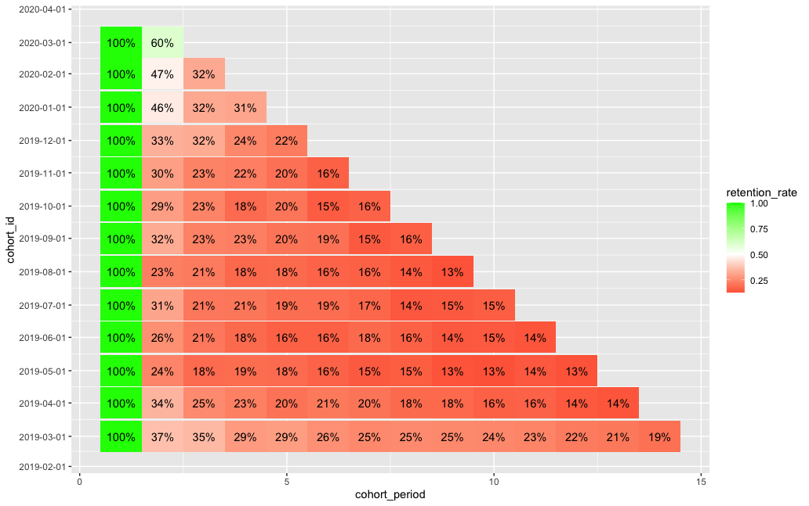
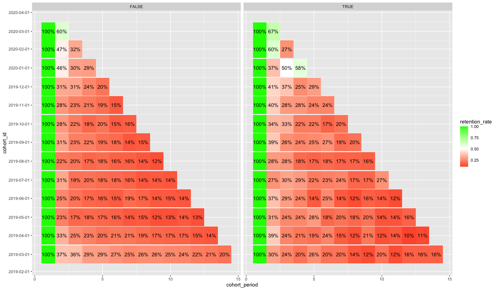

class: inverse, center, middle
```{r setup, include=FALSE}
library (tidyverse)
library(lubridate)
library(knitr)
library(kableExtra)

options(max.print="75")
options(htmltools.dir.version = FALSE)
opts_chunk$set(echo=FALSE,cache=TRUE,prompt=FALSE,tidy=TRUE,comment=NA,message=FALSE,warning=FALSE)
opts_knit$set(width=75)
```

```{css, echo = FALSE}
.pull-left {
  width: 30%;
}
.pull-right {
  width: 70%;
}
.remark-code {
  font-size: 70%;
  padding-left: 50px !important;
}
.pull-left .remark-code {
  font-size: 50%;
}
.reduced_opacity {
  opacity: 0.5;
}
```

# What is Cohort Analysis?

---

# What is Cohort Analysis?

Studying Customer Behavior Over Time

- **Cohort Analysis** is a family of methods to group customers together into time-related "cohorts" in order to track and compare their behavior and characteristics over time.

- Related conceptually to the more scientifically rigorous **Survival Analysis** techniques common in Biostatistics.

Cohort Analysis can be especially useful for subscription-based businesses, organizations with high rates of customer churn, or startups that are attempting to scale rapidly.   It can help inform questions  such as:

- **What is our user growth rate?  How long will it take to reach our target?**

- **Which user acquisition channels and campaigns produce the longest-lived accounts?**

- **Are loyalty programs and interventions effective in strengthening user engagement?**

- **Do promotional and discount programs build or erode customer retention over time?**

---
class: inverse, center, middle

# Some Practical Examples

---

# Case Study: "PizzaApp"

- Actual interview project dataset for well-known ecommerce app
- Extract of 40.6k transactions from March 2019 - May 2020
- 10.3k unique customer accounts, 3.93 average orders per customer at $32.30 average cost. (That's a lot of pizza)
- Promo Codes with discounts from $1 to 5 were issued for many orders.
- Sample of dataset (after some cleanup):
```{r}
df <- readRDS('data/orders_corrected.rdata')
knitr::kable(str(df), format = 'html') %>% 
  kable_styling(font_size = 10)
```
---

# Setting up Cohorts - Step 1

For this exercise, we'll create **customer_cohort**, a table of Monthly cohorts based on the date of a customer's first order with the app.

```{r, echo=TRUE}
# get details of each customer's first order 
customer_first_order <- df %>% select(customer,date_purchased) %>% 
  group_by(customer) %>% 
  summarize(date_purchased = min(date_purchased)) %>% 
  left_join(df) %>% 
  arrange(date_purchased, customer)

# assign cohort_id to each customer based on first order, join in details 
customer_cohort <- df %>% select(customer, order_month) %>% 
  group_by(customer) %>% 
  summarize(cohort_id = min(order_month)) %>% 
  left_join(select(customer_first_order, 
          c('customer','source','has_promo_value','promo_value')), by='customer') 
```

---

# Setting up Cohorts - Step 1

Now we have a table of each unique customer ID, their cohort ID (month of first order), and any other variables from the order data we may wish to explore, such as acquisition channel, use of any promo codes, and value of any promo codes.

**customer_cohort:**
```{r}
knitr::kable(head(customer_cohort), format = 'html') %>% 
  kable_styling(font_size = 16)
```

---

# Setting up Cohorts - Step 2

Next, we aggregate all customers by month in which they had at least one order, and then count the number of customers per cohort, order month, and combinations of variables under consideration.  We'll call this table **cohort_activity**.

```{r, echo=TRUE}
# get each customer_id and order_month in which they had at least 1 order 
customer_activity <- df %>% select('customer','order_month') %>% 
  group_by(customer, order_month) %>% 
  summarize() %>% 
  left_join(customer_cohort) %>% 
  arrange(customer, order_month)

# turn this on its side to get count of active customers and cohort_id by order_month
cohort_activity <- customer_activity %>% 
  group_by(order_month, cohort_id, source, promo_value, has_promo_value) %>% 
  summarize(active_customers = n()) %>% 
  mutate(cohort_period=interval(cohort_id, order_month) %/% months(1) + 1) %>% 
  arrange(cohort_id, order_month)
```

---

# Setting up Cohorts - Step 2

We now have a base table we can start building our analysis upon!

**cohort_activity:**
```{r}
knitr::kable(head(cohort_activity,10), format = 'html') %>% 
  kable_styling(font_size = 16)
```

---

# Analyzing Cohorts - Retention Rate

One great application of Cohort Analysis is comparing retention rates over time using a frequency table. This allows us to examine individual cohort retention rates along the X-axis, and to compare cohorts' "periods" against each other along <br>the Y-axis.

```{r, out.width = "65%"}

```

---

# Analyzing Cohorts - Retention Rate

Let's look at how we built that! To start, we set up a table **cohort_retention_all** that counts the number of active cohort members by month:

```{r, echo=TRUE}
# get cohort counts
cohort_counts <- customer_cohort %>% 
  group_by(across(!customer)) %>% 
  summarize(cohort_count = n()) %>% 
  arrange(cohort_id)

# all customers
cohort_counts_all <- cohort_counts %>% 
  group_by(cohort_id) %>% 
  summarize(cohort_count=sum(cohort_count))

cohort_activity_all <- cohort_activity %>% 
  group_by(order_month, cohort_id) %>% 
  summarize(active_customers = sum(active_customers)) %>% 
  mutate(cohort_period=interval(cohort_id, order_month) %/% months(1) + 1)

cohort_retention_all <- cohort_activity_all %>% 
  left_join(cohort_counts_all) %>% 
  mutate(retention_rate = active_customers / cohort_count) %>%
  arrange(cohort_id, order_month)
```

---
# Analyzing Cohorts - Retention Rate

**cohort_retention_all:**
```{r}
knitr::kable(head(cohort_retention_all,10), format = 'html') %>% 
  kable_styling(font_size = 16)
```

Now, to turn this into a frequency table!

---
# Analyzing Cohorts - Retention Rate
```{r, echo=TRUE, eval=FALSE}
ggplot(cohort_retention_all, aes(x=cohort_period, y=cohort_id, fill=retention_rate)) +
  geom_tile() +
  geom_text(aes(label=sprintf('%.0f%%',retention_rate * 100))) +
  scale_fill_gradient2(low = 'red', high = 'green', midpoint = .50) +
  scale_y_date(date_breaks = '1 month') 
```

```{r, out.width = "60%"}

```

---

# Analyzing Cohorts - Retention Rate

We have a picture of overall retention rate, but now let's add some variables - for example, what effect did customer acquisition via Promo Codes have on retention? 

To start, we set up a table **cohort_retention_has_promo** that counts the number of active cohort members by month:

```{r, echo=TRUE}
cohort_counts_has_promo <- cohort_counts %>% 
  group_by(cohort_id, has_promo_value) %>% 
  summarize(cohort_count = sum(cohort_count))

cohort_activity_has_promo <- cohort_activity %>% 
  group_by(order_month, cohort_id, has_promo_value) %>% 
  summarize(active_customers = sum(active_customers)) %>% 
  mutate(cohort_period=interval(cohort_id, order_month) %/% months(1) + 1)
  
cohort_retention_has_promo <- cohort_activity_has_promo %>% 
  left_join(cohort_counts_has_promo) %>% 
  mutate(retention_rate = active_customers / cohort_count) %>% 
  mutate(cohort=as.character(cohort_id))
```

---
# Analyzing Cohorts - Retention Rate

**cohort_retention_has_promo:**
```{r}
knitr::kable(head(cohort_retention_has_promo,10), format = 'html') %>% 
  kable_styling(font_size = 16)
```

Now, to turn this into a frequency table!

---
# Analyzing Cohorts - Retention Rate
.pull-left[
```{r, echo=TRUE, eval=FALSE}
ggplot(cohort_retention_has_promo, 
       aes(x=cohort_period, 
           y=cohort_id, 
           fill=retention_rate)) +
  geom_tile() +
  geom_text(aes(label=sprintf('%.0f%%',
                  retention_rate * 100))) +
  scale_fill_gradient2(low = 'red', 
                       high = 'green', 
                       midpoint = .50) +
  scale_y_date(date_breaks = '1 month') +
  facet_grid(cols=vars(has_promo_value))
```
Note how we use facet_grid to dimension the results based on the use of a Promo Code for customer acquisition.
]

.pull-right[
```{r}

```
]
---

# You See Where We're Going With This

With some additional data manipulation, there are all kinds of interesting trends one could uncover. 

Using Cohort Analysis could influence your customer acquisition and retention strategies, answering questions such as ...

- **Which cities/regions have the best retention rates?**

- **Which restaurant partners are most successful with repeat business?**

- **Are there particular products or times of day most correlated with retention?**

- **Can you use retention rates to build audience segments for media targeting?**

---

class: inverse, center, middle

# How to Find Out More
---

# More Resources

Many more interesting ways to use Cohort Analysis and related techniques!  

- A Primer on Cohort Analysis<br>
https://www.khoslaventures.com/a-primer-on-cohort-analysis

- Cohort Analysis that Helps You Look Ahead<br>
https://mode.com/blog/cohort-analysis-helps-look-ahead/

- Cohort Analysis with R<br>
http://alexdyachenko.com/all/cohort-analysis-with-r/

- OpenIntro: Survival Analysis in R<br>
https://www.openintro.org/book/surv_in_r/

- GitHub Repo for this presentation:<br>
https://github.com/jefedigital/cohort-analysis

- This deck was made with **xaringan**:<br>
https://github.com/yihui/xaringan

--


